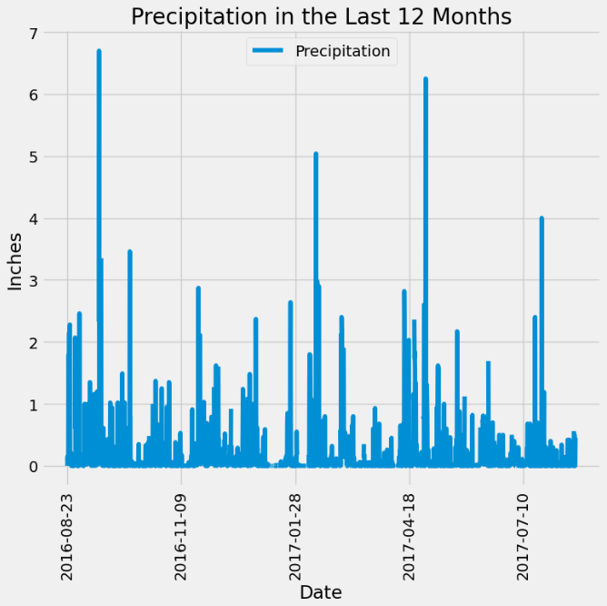
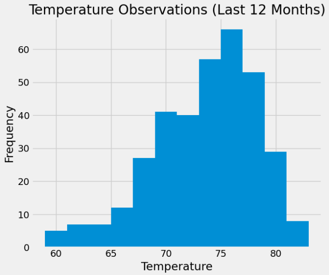
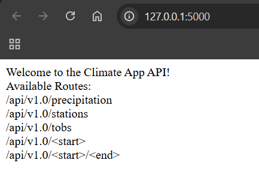
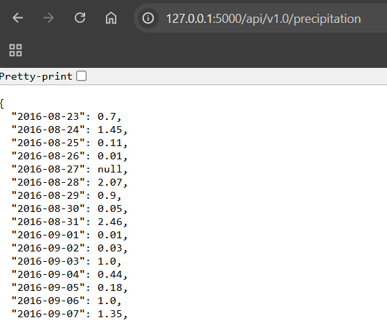
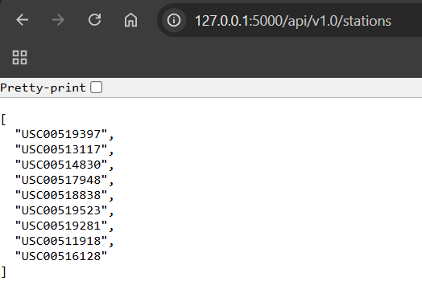
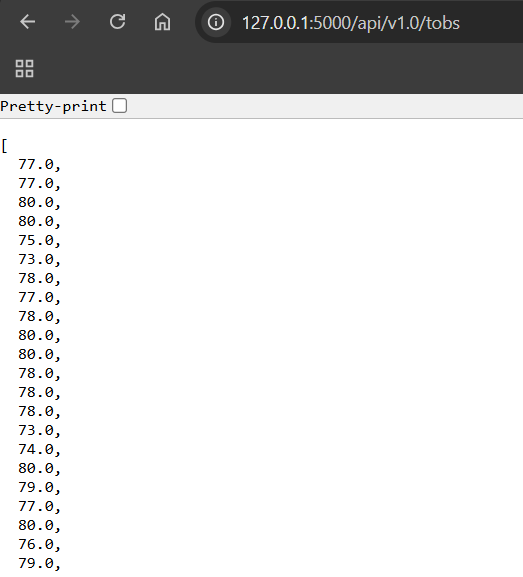
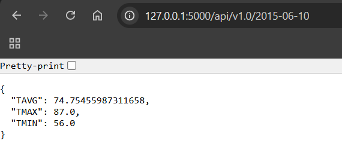
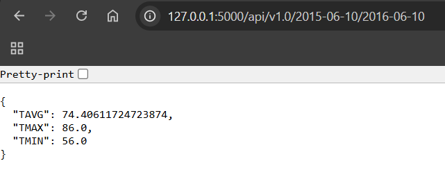

# SQLAlchemy Assignment

## Part 1: Analyze and Explore the Climate Data
Below you can see screenshots of plots of the results of queries that were executed in the climate_starter.ipynb:

<figure>
  
</figure>

<figure>
  
</figure>

## Part 2: Design Your Climate App
Below you can see screenshots of different endpoints of the flask app from app.py:

 Welcome (/) 
<figure>
  
</figure>

 Precipitation 
<figure>
  
</figure>

 Stations 
<figure>
  
</figure>

 Tobs 
<figure>
  
</figure>

 Start 
<figure>
  
</figure>

 Start/End 
<figure>
  
</figure>
